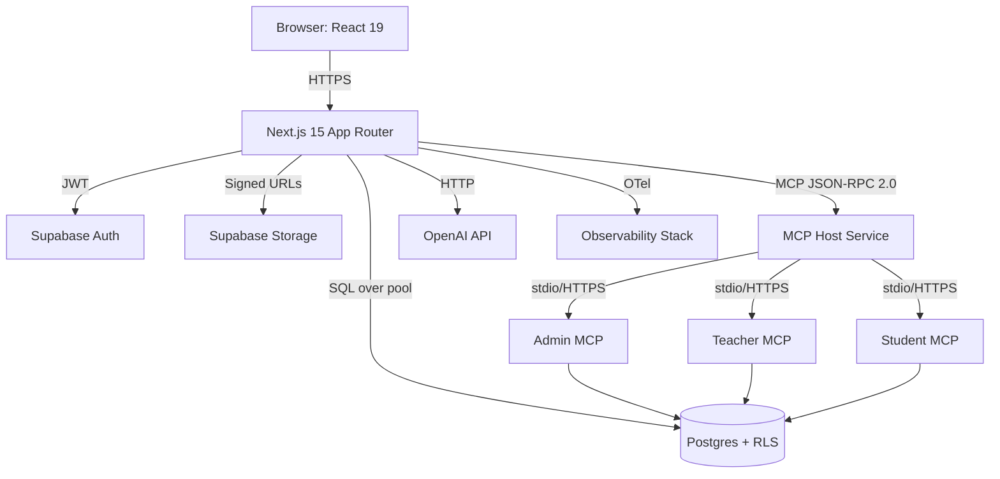

# DESIGN.md — Design Specification (MyCastle)

> **Version:** 2.1.0 | **Status:** Living Document | **Last Updated:** 2025-11-07

---

## 1. Architecture Overview

### 1.1 Context (C4-C1)

```
┌─────────────────────────────────────────────────────────────────┐
│                        USERS                                     │
│  (Teacher / Admin / Student)                                     │
└────────────────────┬────────────────────────────────────────────┘
                     │ HTTPS/WebSocket
                     ▼
┌─────────────────────────────────────────────────────────────────┐
│               Next.js 15 App (Frontend)                          │
│  • React 19 UI • Tailwind CSS • RHF + Zod                       │
└────────────────────┬────────────────────────────────────────────┘
                     │ API Routes
                     ▼
┌─────────────────────────────────────────────────────────────────┐
│                   MCP Host (Orchestrator)                        │
│  • Session management • Authorization • Context aggregation     │
│  • Routes to: Admin MCP | Teacher MCP | Student MCP             │
└────────────────────┬────────────────────────────────────────────┘
                     │
          ┌──────────┼──────────┐
          ▼          ▼          ▼
    ┌─────────┐ ┌─────────┐ ┌─────────┐
    │ Admin   │ │ Teacher │ │ Student │
    │   MCP   │ │   MCP   │ │   MCP   │
    │ Server  │ │ Server  │ │ Server  │
    └────┬────┘ └────┬────┘ └────┬────┘
         │           │           │
         └───────────┼───────────┘
                     ▼
          ┌──────────────────────┐
          │  Supabase/PostgreSQL  │
          │  • RLS enforcement    │
          │  • Drizzle ORM        │
          └──────────────────────┘
```

**Key Design Decision**: **MCP Architecture**
- Role-specific MCP servers isolate context and enforce security boundaries
- Host mediates all interactions (no MCP-to-MCP communication)
- LLM receives aggregated context from Host, not direct MCP access

### 1.2 Containers (C4-C2)



---

## 2. Tech Stack

### 2.1 Frontend
| Technology | Version | Purpose |
|------------|---------|---------|
| **Next.js** | 15 | App Router, API routes, SSR/SSG |
| **React** | 19 | UI components, client-side interactivity |
| **TypeScript** | 5.x | Type safety |
| **Tailwind CSS** | 3.x | Utility-first styling |
| **Radix UI** | Latest | Accessible primitives |
| **React Hook Form** | 7.x | Form state management |
| **Zod** | 3.x | Runtime validation |
| **Recharts** | Latest | Data visualisation |
| **Sonner** | Latest | Toast notifications |

### 2.2 Backend
| Technology | Version | Purpose |
|------------|---------|---------|
| **Next.js API Routes** | 15 | REST/RPC endpoints |
| **Node.js** | 22+ | Runtime |
| **TypeScript** | 5.x | Type safety |
| **Drizzle ORM** | Latest | Type-safe SQL queries |
| **Supabase JS** | Latest | Auth + Storage client |
| **OpenAI SDK** | Latest | LLM integration |
| **OpenTelemetry** | Latest | Observability |

### 2.3 Database
| Technology | Version | Purpose |
|------------|---------|---------|
| **Supabase (PostgreSQL)** | 15+ | Primary database |
| **Drizzle ORM** | Latest | Schema definition + migrations |
| **RLS (Row-Level Security)** | Native | Tenant isolation |

### 2.4 MCP Infrastructure
| Technology | Version | Purpose |
|------------|---------|---------|
| **@modelcontextprotocol/sdk** | Latest | MCP protocol implementation |
| **JSON-RPC 2.0** | Spec | MCP communication protocol |
| **stdio (dev)** | - | Local MCP transport |
| **HTTPS (prod)** | TLS 1.3 | Secure MCP transport |

### 2.5 Tooling
| Tool | Purpose |
|------|---------|
| **ESLint** | Linting |
| **Prettier** | Code formatting |
| **Playwright** | E2E testing |
| **Jest** | Unit/integration testing |
| **GitHub Actions** | CI/CD |

---

## 3. Domain Model & ERD

### 3.1 Entity Relationship Diagram

```mermaid
erDiagram
    Organisation ||--o{ User : has
    User ||--o| Teacher : may_be
    User ||--o| Student : may_be
    Organisation ||--o{ Class : owns
    Class ||--o{ Session : has
    Class ||--o{ Enrolment : binds
    Student ||--o{ Enrolment : has
    Session ||--o{ RegisterEntry : records
    Class ||--o{ Plan : plans_for
    Plan ||--o{ Material : attaches
    Class ||--o{ ForumPost : threads
    User ||--o{ ForumPost : authors
    RegisterEntry }o--|| User : marked_by
    AuditLog }o--|| User : actor
    CEFRDescriptor ||--o{ Plan : describes
```

### 3.2 Key Entities

#### Organisation & Identity
```typescript
type Organisation = {
  id: UUID
  name: string
  locale: string  // en-IE, es-ES, ga-IE
  created_at: timestamp
}

type User = {
  id: UUID  // Supabase Auth user ID
  email: string
  role_scope: 'admin' | 'teacher' | 'student'
  org_id: UUID  // FK to Organisation
  created_at: timestamp
}

type Teacher = {
  id: UUID
  user_id: UUID  // FK to User
  staff_code: string
}

type Student = {
  id: UUID
  user_id: UUID  // FK to User
  date_of_birth: date
  emergency_contact_id: UUID?
}
```

#### Academic Structure
```typescript
type Class = {
  id: UUID
  org_id: UUID  // Tenant isolation
  name: string
  cefr_level: 'A1' | 'A2' | 'B1' | 'B2' | 'C1' | 'C2'
  teacher_id: UUID  // FK to Teacher
}

type Session = {
  id: UUID
  class_id: UUID
  start_at: timestamp
  end_at: timestamp
  room: string?
}

type Enrolment = {
  id: UUID
  class_id: UUID
  student_id: UUID
  active: boolean
}
```

#### Attendance & Audit
```typescript
type RegisterEntry = {
  id: UUID
  session_id: UUID
  student_id: UUID
  status: 'P' | 'A' | 'L'  // Present, Absent, Late
  marked_by: UUID  // FK to User (teacher)
  marked_at: timestamp
  note: string?
  hash: string  // sha256(payload || hash_prev)
  hash_prev: string?  // Previous entry's hash (chain)
}

type AuditLog = {
  id: UUID
  entity: string  // Table name
  entity_id: UUID
  action: 'INSERT' | 'UPDATE' | 'DELETE'
  actor_id: UUID  // FK to User
  diff_json: jsonb  // Before/after
  created_at: timestamp
}
```

#### Curriculum & Planning
```typescript
type CEFRDescriptor = {
  id: UUID
  level: 'A1' | 'A2' | 'B1' | 'B2' | 'C1' | 'C2'
  domain: 'Listening' | 'Reading' | 'Spoken Interaction' | 'Spoken Production' | 'Writing'
  code: string  // e.g., "B1-L-GC" (B1 Listening Global Comprehension)
  text: string  // Full descriptor text
}

type Plan = {
  id: UUID
  class_id: UUID
  session_id: UUID?  // Optional link to specific session
  cefr_level: string
  descriptor_id: UUID  // FK to CEFRDescriptor
  json_plan: jsonb  // Structured lesson plan (objectives, activities, materials, timings)
  created_by: UUID  // FK to User (teacher)
  cached_key: string?  // Deterministic cache key {level,descriptorId,topic?}
  created_at: timestamp
}

type Material = {
  id: UUID
  plan_id: UUID
  title: string
  url: string  // Signed URL to Supabase Storage
  content_hash: string  // SHA256 for integrity
}
```

#### Forum
```typescript
type ForumPost = {
  id: UUID
  class_id: UUID
  author_user_id: UUID
  parent_post_id: UUID?  // For threading
  body: text
  created_at: timestamp
  is_flagged: boolean
}
```

---

## 4. API Design (REST over HTTP; JSON)

### 4.1 Response Envelope
All endpoints return a typed result envelope:
```typescript
type ApiResult<T> =
  | { ok: true; data: T }
  | { ok: false; code: string; message: string }
```

### 4.2 Core Endpoints

#### Lesson Planning
```http
POST /api/lessons/generate
Content-Type: application/json
Authorization: Bearer <JWT>

{
  "cefrLevel": "B1",
  "descriptorId": "uuid",
  "topic": "Travel and Tourism" // optional
}

Response:
{
  "ok": true,
  "data": {
    "planId": "uuid",
    "planJson": {
      "objectives": [...],
      "activities": [...],
      "materials": [...],
      "timings": {...},
      "assessment": {...}
    }
  }
}

Errors:
- 422 SCHEMA_VALIDATION_FAILED
- 429 LLM_TIMEOUT
- 502 LLM_SERVICE_DOWN
```

#### Timetable
```http
GET /api/timetable?role=teacher&userId=<uuid>&weekStart=2025-11-03
Authorization: Bearer <JWT>

Response:
{
  "ok": true,
  "data": {
    "sessions": [
      {
        "id": "uuid",
        "className": "Intermediate B1",
        "startAt": "2025-11-03T09:00:00Z",
        "endAt": "2025-11-03T10:30:00Z",
        "room": "Room 3"
      }
    ]
  }
}
```

#### Register (Attendance)
```http
POST /api/register/:sessionId
Content-Type: application/json
Authorization: Bearer <JWT>

{
  "entries": [
    { "studentId": "uuid", "status": "P" },
    { "studentId": "uuid", "status": "A", "note": "Sick leave" },
    { "studentId": "uuid", "status": "L" }
  ]
}

Response:
{
  "ok": true,
  "data": {
    "saved": 3,
    "hashes": ["sha256...", "sha256...", "sha256..."]
  }
}
```

#### Student Profile
```http
GET /api/students/:id/profile
Authorization: Bearer <JWT>

Response:
{
  "ok": true,
  "data": {
    "public": {
      "name": "Ana García",
      "avatar": "https://..."
    },
    "sensitive": {
      "email": "ana@example.com",
      "phone": "+353..."
    }
  }
}

PATCH /api/students/:id/profile
Content-Type: application/json
Authorization: Bearer <JWT>

{
  "email": "new@example.com"  // Only allow-listed fields
}

Response:
{
  "ok": true,
  "data": {
    "verificationSent": true,
    "pendingUntilVerified": true
  }
}
```

#### Forum
```http
POST /api/forum/:classId/posts
Content-Type: application/json
Authorization: Bearer <JWT>

{
  "body": "What's the difference between 'affect' and 'effect'?",
  "parentPostId": null  // or UUID for replies
}

Response:
{
  "ok": true,
  "data": {
    "postId": "uuid",
    "createdAt": "2025-11-07T12:00:00Z"
  }
}

Errors:
- 429 RATE_LIMIT_EXCEEDED
```

---

## 5. AuthN/Z & Data Security

### 5.1 Authentication Flow
1. User authenticates via Supabase Auth (email/password or OAuth)
2. Supabase issues JWT with claims: `{ sub: userId, org_id: orgId, role_scope: 'teacher' }`
3. Frontend stores JWT in `httpOnly` cookie
4. API routes verify JWT using Supabase JWKS endpoint
5. MCP Host receives verified user context from API routes

### 5.2 Row-Level Security (RLS) Policies

#### Teachers: Class Isolation
```sql
-- Teachers see only assigned classes
CREATE POLICY teacher_class_access ON class
  FOR SELECT
  USING (
    teacher_id IN (
      SELECT t.id FROM teacher t
      WHERE t.user_id = auth.uid()
    )
  );

-- Teachers see only own session registers
CREATE POLICY teacher_register_access ON register_entry
  FOR ALL
  USING (
    session_id IN (
      SELECT s.id FROM session s
      JOIN class c ON s.class_id = c.id
      JOIN teacher t ON c.teacher_id = t.id
      WHERE t.user_id = auth.uid()
    )
  );
```

#### Students: Enrolment Isolation
```sql
-- Students see only enrolled classes
CREATE POLICY student_class_access ON class
  FOR SELECT
  USING (
    id IN (
      SELECT e.class_id FROM enrolment e
      JOIN student st ON e.student_id = st.id
      WHERE st.user_id = auth.uid() AND e.active = true
    )
  );

-- Students see only own profile
CREATE POLICY student_profile_access ON student
  FOR ALL
  USING (user_id = auth.uid());
```

#### Admins: Org-Wide Access
```sql
-- Admins see all within their org
CREATE POLICY admin_org_access ON class
  FOR ALL
  USING (
    org_id IN (
      SELECT u.org_id FROM "user" u
      WHERE u.id = auth.uid() AND u.role_scope = 'admin'
    )
  );
```

### 5.3 Column-Level Encryption
Sensitive PII encrypted at rest using Supabase's native encryption or application-level keyed encryption:
- `student.date_of_birth`
- `student.emergency_contact_id`
- `user.email` (hashed for lookups, encrypted for display)

### 5.4 Material Access (Signed URLs)
Materials stored in Supabase Storage with signed URLs (short TTL: 24h):
```typescript
const { data, error } = await supabase.storage
  .from('materials')
  .createSignedUrl(filePath, 86400); // 24h expiry
```

---

## 6. Lesson Planning Flow (AI-Assisted)

### 6.1 Architecture

```
┌──────────────┐
│   Teacher    │
│     UI       │
└──────┬───────┘
       │ POST /api/lessons/generate
       │ { cefrLevel, descriptorId, topic? }
       ▼
┌──────────────────────────────────────┐
│  Next.js API Route                   │
│  1. Validate input (Zod)             │
│  2. Check cache (Redis/in-memory)    │
│  3. If miss → call Teacher MCP       │
└──────┬───────────────────────────────┘
       │
       ▼
┌──────────────────────────────────────┐
│  Teacher MCP Server                  │
│  1. Fetch CEFR descriptor text       │
│  2. Build deterministic prompt       │
│  3. Call LLM with schema constraint  │
│  4. Validate response vs Zod         │
│  5. Retry once if schema mismatch    │
└──────┬───────────────────────────────┘
       │
       ▼
┌──────────────────────────────────────┐
│  OpenAI API                          │
│  • GPT-4 with JSON mode              │
│  • Time-box: 4s                      │
│  • Schema-constrained output         │
└──────┬───────────────────────────────┘
       │
       ▼
┌──────────────────────────────────────┐
│  Teacher MCP Server (cont.)          │
│  1. Persist Plan with content hash   │
│  2. Cache with key {level,desc,topic}│
│  3. Return planId + planJson         │
└──────┬───────────────────────────────┘
       │
       ▼
┌──────────────┐
│   Teacher    │
│     UI       │
│  (Hydrate)   │
└──────────────┘
```

### 6.2 Plan JSON Schema (Zod)
```typescript
const PlanSchema = z.object({
  objectives: z.array(z.string()).min(1).max(5),
  activities: z.array(z.object({
    title: z.string(),
    duration: z.number().positive(), // minutes
    description: z.string(),
    materials: z.array(z.string())
  })),
  materials: z.array(z.object({
    title: z.string(),
    url: z.string().url().optional(),
    type: z.enum(['handout', 'video', 'audio', 'worksheet'])
  })),
  timings: z.object({
    warmUp: z.number(),
    presentation: z.number(),
    practice: z.number(),
    production: z.number(),
    coolDown: z.number()
  }),
  assessment: z.object({
    formative: z.array(z.string()),
    summative: z.string().optional()
  })
});
```

### 6.3 Deterministic Prompt Construction
```typescript
function buildLessonPlanPrompt(
  descriptor: CEFRDescriptor,
  topic?: string
): string {
  return `
Generate a CEFR-aligned lesson plan for:
- Level: ${descriptor.level}
- Domain: ${descriptor.domain}
- Descriptor: "${descriptor.text}"
${topic ? `- Topic: ${topic}` : ''}

Return a JSON object matching this schema:
${JSON.stringify(PlanSchema.shape, null, 2)}

Ensure:
1. Activities align with CEFR descriptor
2. Total timing = 90 minutes
3. Materials are realistic and accessible
4. Assessment is formative and aligned
  `;
}
```

### 6.4 Retry Strategy
```typescript
async function generatePlanWithRetry(
  prompt: string,
  maxRetries = 2
): Promise<Plan> {
  for (let attempt = 0; attempt < maxRetries; attempt++) {
    const response = await callLLM(prompt, { timeout: 4000 });
    const parsed = PlanSchema.safeParse(response);

    if (parsed.success) {
      return parsed.data;
    }

    console.warn(`Schema validation failed (attempt ${attempt + 1})`);
  }

  throw new Error('SCHEMA_VALIDATION_FAILED');
}
```

### 6.5 Caching Strategy
**Cache Key**: `sha256(cefrLevel + descriptorId + topic)`
**TTL**: 30 days (invalidate on descriptor update)
**Implementation**: Redis or in-memory LRU cache

```typescript
const cacheKey = sha256(`${cefrLevel}-${descriptorId}-${topic || ''}`);
const cached = await cache.get(cacheKey);
if (cached) return cached;

const plan = await generatePlan(...);
await cache.set(cacheKey, plan, { ttl: 30 * 24 * 60 * 60 });
return plan;
```

---

## 7. Timetable & Register

### 7.1 Timetable Query Optimisation

#### Indexes
```sql
-- Teachers
CREATE INDEX idx_session_teacher_week ON session
  USING btree (class_id, start_at)
  WHERE start_at >= CURRENT_DATE - INTERVAL '7 days';

CREATE INDEX idx_class_teacher ON class (teacher_id);

-- Students
CREATE INDEX idx_enrolment_student ON enrolment (student_id, active)
  WHERE active = true;

CREATE INDEX idx_session_class_week ON session (class_id, start_at);
```

#### Query
```sql
-- Teacher timetable (p95 < 200ms)
SELECT
  s.id, s.start_at, s.end_at, s.room,
  c.name AS class_name, c.cefr_level
FROM session s
JOIN class c ON s.class_id = c.id
JOIN teacher t ON c.teacher_id = t.id
WHERE t.user_id = $1  -- JWT sub claim
  AND s.start_at >= $2  -- weekStart
  AND s.start_at < $2 + INTERVAL '7 days'
ORDER BY s.start_at;
```

#### Caching
**Cache Key**: `timetable:{role}:{userId}:{weekStart}`
**TTL**: 1 hour (invalidate on session CRUD)
**Implementation**: Next.js `revalidateTag` or Redis

### 7.2 Register (Attendance) Write Flow

#### Hash Chain Implementation
```typescript
async function createRegisterEntry(
  sessionId: UUID,
  studentId: UUID,
  status: 'P' | 'A' | 'L',
  markedBy: UUID,
  note?: string
): Promise<RegisterEntry> {
  // 1. Get previous entry hash (chain)
  const prevEntry = await db
    .select({ hash: registerEntry.hash })
    .from(registerEntry)
    .where(eq(registerEntry.sessionId, sessionId))
    .orderBy(desc(registerEntry.markedAt))
    .limit(1);

  const hashPrev = prevEntry[0]?.hash || null;

  // 2. Compute payload hash
  const payload = JSON.stringify({
    sessionId,
    studentId,
    status,
    markedBy,
    markedAt: new Date(),
    note: note || null
  });

  const hash = sha256(payload + (hashPrev || ''));

  // 3. Insert entry
  const [entry] = await db.insert(registerEntry).values({
    sessionId,
    studentId,
    status,
    markedBy,
    markedAt: new Date(),
    note,
    hash,
    hashPrev
  }).returning();

  // 4. Log to audit trail
  await db.insert(auditLog).values({
    entity: 'register_entry',
    entityId: entry.id,
    action: 'INSERT',
    actorId: markedBy,
    diffJson: { after: entry }
  });

  return entry;
}
```

#### Bulk Present UI Flow
```typescript
// Client-side optimistic update
function handleBulkPresent(students: Student[]) {
  // Optimistically mark all present
  setAttendance(students.map(s => ({ id: s.id, status: 'P' })));

  // Send to server
  fetch(`/api/register/${sessionId}`, {
    method: 'POST',
    body: JSON.stringify({
      entries: students.map(s => ({ studentId: s.id, status: 'P' }))
    })
  })
  .then(res => res.json())
  .then(result => {
    if (!result.ok) {
      // Rollback on failure
      toast.error('Failed to save attendance');
      revertAttendance();
    } else {
      toast.success('Attendance saved');
    }
  });
}
```

#### Edit Window Policy
- **Same day**: Teacher can edit freely
- **Next day+**: Requires admin approval
- **All edits**: Logged in `AuditLog` with diff

```typescript
function canEditRegisterEntry(
  entry: RegisterEntry,
  actorRole: string
): boolean {
  const isToday = isSameDay(entry.markedAt, new Date());

  if (actorRole === 'admin') return true;
  if (actorRole === 'teacher' && isToday) return true;

  return false;
}
```

---

## 8. Student Profile (PII Management)

### 8.1 Table Split
```sql
-- Public data (accessible by teachers/admin)
CREATE TABLE student_public (
  id UUID PRIMARY KEY,
  user_id UUID REFERENCES "user"(id),
  name TEXT NOT NULL,
  avatar_url TEXT,
  created_at TIMESTAMPTZ DEFAULT NOW()
);

-- Sensitive data (restricted access)
CREATE TABLE student_sensitive (
  id UUID PRIMARY KEY REFERENCES student_public(id),
  date_of_birth DATE,
  phone TEXT,
  emergency_contact_id UUID,
  created_at TIMESTAMPTZ DEFAULT NOW()
);
```

### 8.2 RLS Policies
```sql
-- Students see own sensitive data
CREATE POLICY student_sensitive_self ON student_sensitive
  FOR ALL
  USING (
    id IN (
      SELECT sp.id FROM student_public sp
      WHERE sp.user_id = auth.uid()
    )
  );

-- Admins see all within org
CREATE POLICY admin_sensitive_access ON student_sensitive
  FOR SELECT
  USING (
    id IN (
      SELECT sp.id FROM student_public sp
      JOIN "user" u ON sp.user_id = u.id
      JOIN "user" admin ON admin.org_id = u.org_id
      WHERE admin.id = auth.uid() AND admin.role_scope = 'admin'
    )
  );
```

### 8.3 Field Verification (Email/Phone)
```typescript
async function updateStudentEmail(
  studentId: UUID,
  newEmail: string
): Promise<void> {
  // 1. Generate verification code
  const code = crypto.randomBytes(3).toString('hex'); // 6 chars

  // 2. Store pending change
  await db.insert(pendingVerification).values({
    studentId,
    field: 'email',
    value: newEmail,
    code,
    expiresAt: new Date(Date.now() + 24 * 60 * 60 * 1000) // 24h
  });

  // 3. Send email with code
  await sendEmail(newEmail, {
    subject: 'Verify your new email address',
    body: `Your verification code is: ${code}`
  });

  // 4. Log change attempt
  await db.insert(auditLog).values({
    entity: 'student',
    entityId: studentId,
    action: 'UPDATE',
    actorId: studentId,
    diffJson: { field: 'email', pendingValue: newEmail }
  });
}
```

---

## 9. Forum Module

### 9.1 Rate Limiting (Token Bucket)
```typescript
class TokenBucket {
  private tokens: Map<string, { count: number; lastRefill: Date }>;

  constructor(
    private capacity = 10,
    private refillRate = 10, // tokens per 10 minutes
    private refillInterval = 10 * 60 * 1000 // 10 minutes
  ) {
    this.tokens = new Map();
  }

  consume(key: string): boolean {
    const now = new Date();
    const bucket = this.tokens.get(key) || {
      count: this.capacity,
      lastRefill: now
    };

    // Refill tokens
    const elapsed = now.getTime() - bucket.lastRefill.getTime();
    const refills = Math.floor(elapsed / this.refillInterval);
    if (refills > 0) {
      bucket.count = Math.min(this.capacity, bucket.count + refills * this.refillRate);
      bucket.lastRefill = new Date(bucket.lastRefill.getTime() + refills * this.refillInterval);
    }

    // Try to consume
    if (bucket.count > 0) {
      bucket.count--;
      this.tokens.set(key, bucket);
      return true;
    }

    return false;
  }
}

// Usage
const forumRateLimiter = new TokenBucket();

app.post('/api/forum/:classId/posts', async (req, res) => {
  const key = `forum:${req.user.id}:${req.params.classId}`;

  if (!forumRateLimiter.consume(key)) {
    return res.status(429).json({
      ok: false,
      code: 'RATE_LIMIT_EXCEEDED',
      message: 'Too many posts. Please wait.'
    });
  }

  // Proceed with post creation
});
```

### 9.2 Moderation Queue
```sql
-- Flagged posts
CREATE TABLE forum_flag (
  id UUID PRIMARY KEY DEFAULT gen_random_uuid(),
  post_id UUID REFERENCES forum_post(id),
  flagged_by UUID REFERENCES "user"(id),
  reason TEXT,
  created_at TIMESTAMPTZ DEFAULT NOW()
);

-- Auto-hide after 3 flags
CREATE OR REPLACE FUNCTION auto_hide_flagged_posts()
RETURNS TRIGGER AS $$
BEGIN
  UPDATE forum_post
  SET is_flagged = true
  WHERE id = NEW.post_id
    AND (SELECT COUNT(*) FROM forum_flag WHERE post_id = NEW.post_id) >= 3;
  RETURN NEW;
END;
$$ LANGUAGE plpgsql;

CREATE TRIGGER trigger_auto_hide
AFTER INSERT ON forum_flag
FOR EACH ROW
EXECUTE FUNCTION auto_hide_flagged_posts();
```

---

## 10. Observability (OpenTelemetry)

### 10.1 Instrumentation
```typescript
import { NodeTracerProvider } from '@opentelemetry/sdk-trace-node';
import { BatchSpanProcessor } from '@opentelemetry/sdk-trace-base';
import { OTLPTraceExporter } from '@opentelemetry/exporter-trace-otlp-http';

const provider = new NodeTracerProvider();
const exporter = new OTLPTraceExporter({
  url: process.env.OTEL_EXPORTER_ENDPOINT
});

provider.addSpanProcessor(new BatchSpanProcessor(exporter));
provider.register();

// Usage in API routes
import { trace } from '@opentelemetry/api';

const tracer = trace.getTracer('mycastle-api');

export async function POST(req: Request) {
  const span = tracer.startSpan('POST /api/lessons/generate');

  try {
    const result = await generateLesson(req.body);
    span.setStatus({ code: SpanStatusCode.OK });
    return Response.json(result);
  } catch (error) {
    span.setStatus({ code: SpanStatusCode.ERROR, message: error.message });
    throw error;
  } finally {
    span.end();
  }
}
```

### 10.2 PII Scrubbing
```typescript
import { SpanProcessor, ReadableSpan } from '@opentelemetry/sdk-trace-base';

class PIIScrubberProcessor implements SpanProcessor {
  private readonly patterns = [
    /\b[A-Za-z0-9._%+-]+@[A-Za-z0-9.-]+\.[A-Z|a-z]{2,}\b/g, // emails
    /\b\+?\d{1,4}[-.\s]?\(?\d{1,4}\)?[-.\s]?\d{1,4}[-.\s]?\d{1,9}\b/g, // phones
  ];

  onStart() {}

  onEnd(span: ReadableSpan) {
    const attrs = span.attributes;
    for (const key in attrs) {
      const value = attrs[key];
      if (typeof value === 'string') {
        for (const pattern of this.patterns) {
          attrs[key] = value.replace(pattern, '[REDACTED]');
        }
      }
    }
  }

  shutdown() {
    return Promise.resolve();
  }

  forceFlush() {
    return Promise.resolve();
  }
}

provider.addSpanProcessor(new PIIScrubberProcessor());
```

### 10.3 Key Spans
- `POST /api/lessons/generate` (p95 < 5s)
- `POST /api/register/:sessionId` (p95 < 300ms)
- `GET /api/timetable` (p95 < 200ms)
- `DB query: fetchTimetable` (p95 < 100ms)
- `LLM call: generatePlan` (p95 < 4s)

---

## 11. Error Handling Strategy

### 11.1 Result Pattern
```typescript
type Result<T, E = Error> = Ok<T> | Err<E>;

type Ok<T> = { ok: true; data: T };
type Err<E> = { ok: false; error: E };

function ok<T>(data: T): Ok<T> {
  return { ok: true, data };
}

function err<E>(error: E): Err<E> {
  return { ok: false, error };
}

// Usage
async function generateLesson(input: LessonInput): Promise<Result<Plan, string>> {
  const validated = LessonInputSchema.safeParse(input);
  if (!validated.success) {
    return err('SCHEMA_VALIDATION_FAILED');
  }

  try {
    const plan = await callLLM(validated.data);
    return ok(plan);
  } catch (e) {
    if (e instanceof TimeoutError) {
      return err('LLM_TIMEOUT');
    }
    return err('LLM_SERVICE_DOWN');
  }
}
```

### 11.2 Circuit Breaker
```typescript
class CircuitBreaker {
  private failures = 0;
  private state: 'CLOSED' | 'OPEN' | 'HALF_OPEN' = 'CLOSED';
  private lastFailure?: Date;

  constructor(
    private threshold = 5,
    private timeout = 60000 // 1 minute
  ) {}

  async call<T>(fn: () => Promise<T>): Promise<T> {
    if (this.state === 'OPEN') {
      if (Date.now() - this.lastFailure!.getTime() > this.timeout) {
        this.state = 'HALF_OPEN';
      } else {
        throw new Error('CIRCUIT_OPEN');
      }
    }

    try {
      const result = await fn();
      if (this.state === 'HALF_OPEN') {
        this.state = 'CLOSED';
        this.failures = 0;
      }
      return result;
    } catch (error) {
      this.failures++;
      this.lastFailure = new Date();

      if (this.failures >= this.threshold) {
        this.state = 'OPEN';
      }

      throw error;
    }
  }
}

// Usage
const llmCircuitBreaker = new CircuitBreaker();

async function callLLM(prompt: string): Promise<string> {
  return llmCircuitBreaker.call(() =>
    openai.chat.completions.create({ ... })
  );
}
```

---

## 12. Performance

### 12.1 Database Optimisation
- **Indexes**: All FKs indexed, compound indexes on hot filters
- **EXPLAIN ANALYZE**: Required in PR for new queries
- **Pagination**: Cursor-based for forum/posts
- **Query budgets**: p95 < 100ms for DB queries

### 12.2 Caching
- **Timetable**: Next.js `revalidateTag` or Redis, TTL 1h
- **CEFR plans**: In-memory LRU or Redis, TTL 30d
- **Static assets**: CDN with HTTP caching

### 12.3 CDN & Static Assets
- Materials served from Supabase Storage with CDN
- Next.js static assets from Vercel Edge Network
- HTTP caching headers: `Cache-Control: public, max-age=31536000, immutable`

---

## 13. Accessibility & i18n

### 13.1 WCAG 2.2 AA
- **Keyboard navigation**: Full keyboard access for register and planner
- **ARIA**: All interactive controls have ARIA labels
- **Focus management**: Focus traps in modals, focus visible on all controls
- **Contrast**: All text meets 4.5:1 ratio
- **Screen reader testing**: NVDA/JAWS compatibility

### 13.2 Internationalisation
```typescript
// Message catalogues
const messages = {
  'en-IE': {
    'attendance.mark_present': 'Mark Present',
    'attendance.mark_absent': 'Mark Absent'
  },
  'es-ES': {
    'attendance.mark_present': 'Marcar Presente',
    'attendance.mark_absent': 'Marcar Ausente'
  },
  'ga-IE': {
    'attendance.mark_present': 'Marcáil i Láthair',
    'attendance.mark_absent': 'Marcáil as Láthair'
  }
};

// Date/number localisation
import { format } from 'date-fns';
import { enIE, es, ga } from 'date-fns/locale';

const locale = {
  'en-IE': enIE,
  'es-ES': es,
  'ga-IE': ga
}[userLocale];

format(date, 'PPP', { locale });
```

---

## 14. Configuration & Secrets

### 14.1 Environment Variables
```bash
# .env.local (example)
NEXT_PUBLIC_SUPABASE_URL=https://xxx.supabase.co
NEXT_PUBLIC_SUPABASE_ANON_KEY=eyJhbGciOiJIUzI1NiIsInR5cCI6IkpXVCJ9...
SUPABASE_SERVICE_ROLE_KEY=eyJhbGciOiJIUzI1NiIsInR5cCI6IkpXVCJ9... # SECRET
OPENAI_API_KEY=sk-proj-... # SECRET
OTEL_EXPORTER_ENDPOINT=https://api.honeycomb.io/v1/traces
DATABASE_URL=postgresql://...
REDIS_URL=redis://...
```

### 14.2 Secret Rotation
- Quarterly rotation for all API keys
- Supabase JWT secret rotated via dashboard
- Separate secrets per environment (dev/staging/prod)
- No secrets in client bundle (NEXT_PUBLIC_* only for public keys)

---

## 15. Deployment & Ops

### 15.1 Environments
| Environment | Branch | Database | LLM | MCP Transport |
|-------------|--------|----------|-----|---------------|
| **Development** | `main` | Local Postgres | OpenAI (shared key) | stdio |
| **Staging** | `staging` | Supabase (staging project) | OpenAI (staging key) | HTTPS |
| **Production** | `production` | Supabase (prod project) | OpenAI (prod key) | HTTPS |

### 15.2 CI/CD Pipeline (GitHub Actions)
```yaml
name: CI/CD Pipeline

on:
  push:
    branches: [main, staging, production]
  pull_request:
    branches: [main]

jobs:
  lint:
    runs-on: ubuntu-latest
    steps:
      - uses: actions/checkout@v3
      - run: npm ci
      - run: npm run lint

  typecheck:
    runs-on: ubuntu-latest
    steps:
      - uses: actions/checkout@v3
      - run: npm ci
      - run: npm run typecheck

  unit-tests:
    runs-on: ubuntu-latest
    steps:
      - uses: actions/checkout@v3
      - run: npm ci
      - run: npm run test:unit

  integration-tests:
    runs-on: ubuntu-latest
    services:
      postgres:
        image: postgres:15
        env:
          POSTGRES_PASSWORD: postgres
        options: >-
          --health-cmd pg_isready
          --health-interval 10s
          --health-timeout 5s
          --health-retries 5
    steps:
      - uses: actions/checkout@v3
      - run: npm ci
      - run: npm run db:migrate
      - run: npm run test:integration

  e2e-tests:
    runs-on: ubuntu-latest
    steps:
      - uses: actions/checkout@v3
      - run: npm ci
      - run: npx playwright install --with-deps
      - run: npm run test:e2e

  build:
    runs-on: ubuntu-latest
    steps:
      - uses: actions/checkout@v3
      - run: npm ci
      - run: npm run build

  deploy-preview:
    if: github.event_name == 'pull_request'
    needs: [lint, typecheck, unit-tests, integration-tests, e2e-tests, build]
    runs-on: ubuntu-latest
    steps:
      - uses: actions/checkout@v3
      - run: vercel --token=${{ secrets.VERCEL_TOKEN }}
```

### 15.3 Backups
- **Database**: Nightly automated backups (Supabase) + WAL archiving
- **Storage**: Versioning enabled on Supabase Storage bucket
- **Recovery drills**: Quarterly restore tests
- **RTO**: 4 hours
- **RPO**: 24 hours

---

## 16. Threat Model (STRIDE), Risks, Trade-offs

### 16.1 STRIDE Analysis
| Threat | Mitigation |
|--------|------------|
| **Spoofing** (JWT forge) | Enforce JWKs, short TTL, HTTPS-only cookies |
| **Tampering** (register edits) | Hash chain + immutable AuditLog |
| **Repudiation** | AuditLog with actor, IP (pseudonymised), timestamp |
| **Info Disclosure** | Strict RLS, PII scrubbing in telemetry, column encryption |
| **DoS** | Rate limits (token bucket), circuit breakers, query timeouts |
| **Elevation** | Least-privilege RLS policies, migration gate tests |

### 16.2 Trade-offs
| Decision | Rationale | Trade-off |
|----------|-----------|-----------|
| **Drizzle over Prisma** | Lighter footprint, closer to SQL | Smaller ecosystem, less tooling |
| **Supabase over Firebase** | SQL + RLS needs, open-source | Vendor lock-in to Supabase |
| **MCP over monolith** | Security isolation, role boundaries | Higher complexity, more moving parts |
| **API routes over workers** | Simplicity for v1, easier debugging | Less horizontal scalability |

### 16.3 Alternatives Considered
- **Prisma instead of Drizzle**: Rejected due to heavier runtime overhead
- **Firebase instead of Supabase**: Rejected due to lack of RLS and SQL flexibility
- **Worker-based LLM calls**: Deferred to v2 for simplicity in v1
- **GraphQL instead of REST**: Rejected for v1 (REST simpler, less overhead)

---

## 17. Traceability to Requirements

All design decisions reference REQ IDs. See comprehensive mapping in REQ §15 and TASKS §10.

### Key Mappings (Excerpt)
| Design Section | REQ IDs | TASKS IDs |
|----------------|---------|-----------|
| **§6 Lesson Planning** | REQ-T-001, REQ-T-002 | T-031, T-032, T-033 |
| **§7 Register** | REQ-T-003, REQ-T-004, REQ-A-001, REQ-A-002 | T-020, T-023, T-024 |
| **§5 RLS Policies** | REQ-A-004 | T-023 |
| **§8 Student Profile** | REQ-S-003 | T-060 |
| **§9 Forum** | REQ-S-004 | T-050, T-052 |
| **§10 Observability** | REQ-A-005 | T-057 |

---

## 18. Related Documents

- **REQ.md**: Requirements specification
- **TASKS.md**: Task breakdown and acceptance criteria
- **spec/**: Detailed MCP architecture specs
  - `spec/01-overview.md`: Project overview
  - `spec/02-system-architecture.md`: System architecture details
  - `spec/03-mcp.md`: MCP protocol implementation
  - `spec/04-admin-mcp.md`: Admin MCP specification
  - `spec/05-teacher-mcp.md`: Teacher MCP specification
  - `spec/06-student-mcp.md`: Student MCP specification
  - `spec/08-database.md`: Complete database schema
  - `spec/09-mcp-interaction-patterns.md`: MCP interaction patterns

---

## 19. Version History

| Version | Date | Author | Changes |
|---------|------|--------|---------|
| 2.1.0 | 2025-11-07 | Eoin Malone + Claude Code | Integrated DESIGN structure with MCP architecture |
| 2.0.0 | 2025-10-31 | Eoin Malone + Claude Code | Complete MCP architecture restructure |
| 1.0.0 | 2025-10-30 | Eoin Malone | Initial consolidated specification |

---

**Status**: ✅ Complete and aligned with REQ.md and TASKS.md
**Next Review**: 2025-11-14 (weekly cadence)
**Sign-off**: Pending technical architecture review
